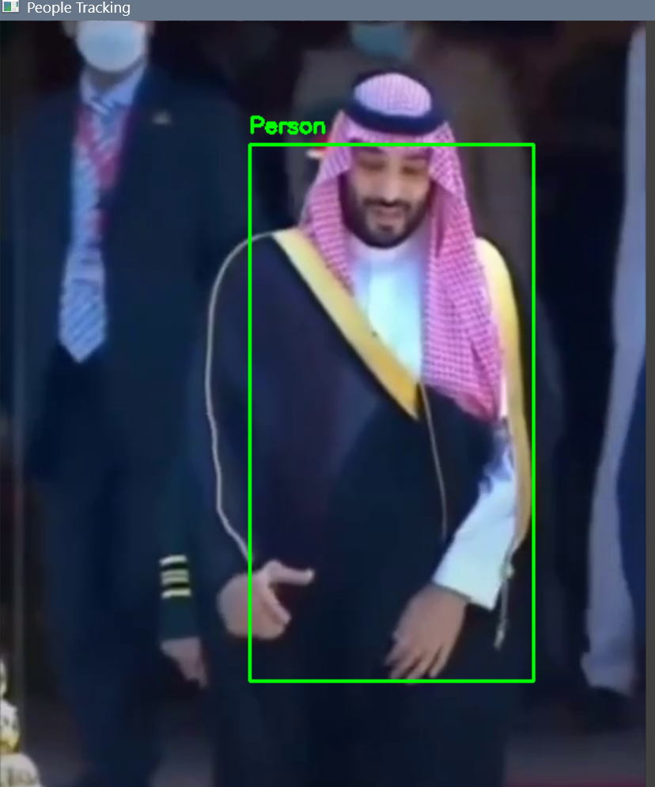

# 🎯 Object Tracking using OpenCV + MobileNet SSD

This project detects and tracks a **person** in a video using:
- **OpenCV** in Python
- **MobileNet SSD** (for initial detection)
- **CSRT Tracker** (for robust tracking)

---

## 📌 Features

- ✅ Object Detection using MobileNet SSD
- ✅ Object Tracking using CSRT Tracker
- ✅ Input from video file or webcam
- ✅ Save the output with bounding boxes to a new video file

---

## 📂 Project Files

- `people_tracking.py` — Main Python script
- `test_video.mp4` — Sample input video
- `output.avi` — Output video with object tracking
- `model/`
  - `MobileNetSSD_deploy.prototxt` — Network architecture definition
  - `MobileNetSSD_deploy.caffemodel` — Pretrained MobileNet SSD weights

---

## 🧠 Model Files

This project uses the [MobileNet SSD model](https://github.com/chuanqi305/MobileNet-SSD) for object detection.

Download the required model files:

- [`deploy.prototxt`](https://github.com/chuanqi305/MobileNet-SSD/blob/master/deploy.prototxt) – Network architecture
- [`mobilenet_iter_73000.caffemodel`](https://github.com/chuanqi305/MobileNet-SSD/blob/bb17b6c3eef36d80be441ae8e5339be66e8e3b7a/mobilenet_iter_73000.caffemodel) – Pretrained model weights

After downloading, place both files in a folder called `model/` in the root directory of the project.

---

## ▶️ How to Run

1. Install dependencies:
   
```bash
pip install opencv-python
```
---
2. Make sure the following files are in the same directory:
   
- `people_tracking.py`
- `test_video.mp4` 
- `MobileNetSSD_deploy.prototxt`
- `MobileNetSSD_deploy.caffemodel`

---
3. Run the script:
   
 ```bash
   python  people_tracking.py
 ```
---
4. The output video will be saved as `output.avi`.

💡 Notes
---
Press q to stop the video window manually.

You can replace `test_video.mp4` with your own video file by updating the path in the script.

---

## 📸 Output Sample
   

